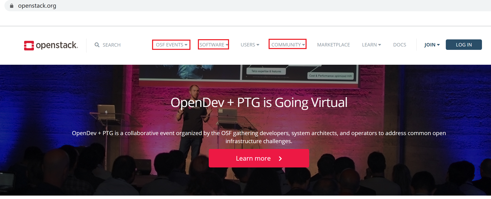
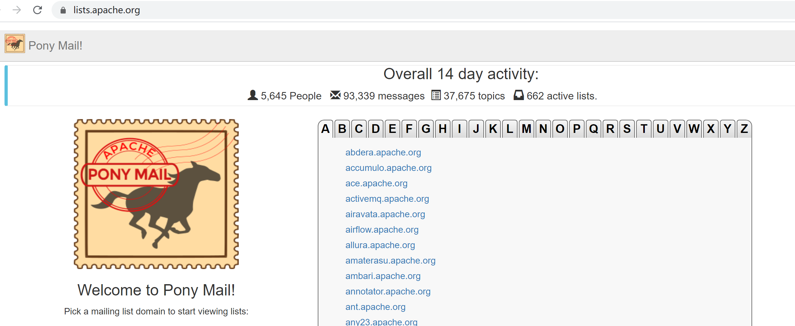

---

---

<h2 id="如何在社区寻求帮助？">如何在社区寻求帮助？</h2>

当我们作为一个新人加入社区以后，可能会遇到各类问题，那么社区有哪些求助渠道，如何通过这些渠道获取相应的帮助？本文将围绕这两个问题，给出一些方法和建议，希望可以给您一些参考。 
一般而言，寻求帮助的方式主要有两种形式： 
一种是静态的，即求助者通过一些指导文档、公告、指南等直接获得所需信息。 
一种是动态的，即互动动式的，求助者通过同某一个社区参与者或某个社区组织进行沟通交流，在对话与探讨中获取所需信息。

<h3 id="静态求助渠道">静态求助渠道</h3>

社区的公告、指南等信息一般会通过社区门户网站、社区邮件、SIG组README文档等多种方式发布，经常关注这些发布渠道就可以获得很多帮助信息：

<ol>
<li>关注社区门户网站 
社区门户网站是一个开源社区最权威的信息发布渠道。社区参与者可以从这里获取到很多社区的有效信息。比如社区的主旨，社区遵循的开源协议，社区最新的活动信息，社区入门指南，社区使用的代码托管平台等等。例如openstack的门户网站<a href="https://www.openstack.org">https://www.openstack.org</a>，您可以在OSF EVENTS页签找到openstack近期事件（比如Openstack Days信息），可以在SOFTWARE页签找到openstack软件系统架构，可以在 COMMUNITY页签找到社区贡献途径等等，还有如何入门，如何配置开发环境……都有比较详细的介绍。 
如果对某个开源社区感兴趣，您可以收藏该社区的门户网站，并定期关注。我相信您可以在这里找到很多问题的答案。社区门户网站地址通常都可以使用关键字通过搜索引擎找到。 
</li>
<li>订阅社区邮件列表 
邮件列表是一种通过用户订阅的方式实现电子邮件的群收群发的服务。它就像一个广播站，订阅邮件后，你可以“收听”别人通过它发出的“广播消息”（包括社区公告、会议通知、问题讨论等信息），也可以通过它来“广播”自己希望发布的信息给社区的其他参与者（订阅了相同邮件列表的人）。将它视为静态求助渠道时，我们通常作为邮件接受者，只需接收，无需回复，从收到的邮件中筛选出自己感兴趣的信息。当然，更推荐的方式还是将邮件列表作为动态的交流渠道，这样有利于快速融入社区。 
大多数的开源社区都提供了邮件列表订阅功能。以Apache为例，提供的邮件列表<a href="https://community.apache.org/lists.html">https://community.apache.org/lists.html</a>，在其中还能找到历史邮件信息。 
所以订阅邮件列表，是您在社区里获得最新通知消息的不错途径。 
</li>
<li>阅览README文档 
README文档也是开源社区中一种约定俗成的信息表达方式。它是社区中的某一个人或组织放置在各自代码仓库下的一个文本格式文档，用来描述该仓库对应项目的相关信息。几乎每个项目都会在REPO仓库中提供自己的README文档。我们可以通过它学习到该项目的背景知识，组织功能，项目中软件的系统设计，开发调试环境的搭建指导等。我们以kubernates为例，它的代码托管在github上，其项目主干的README文档：<a href="https://github.com/kubernetes/kubernetes/blob/master/README.md">https://github.com/kubernetes/kubernetes/blob/master/README.md</a>，其中我们可以看到 “What is Kubernetes”、“To start using Kubernetes”、“To start developering Kubernetes”等权威且实用的信息。 
作为参与者，通过仔细阅读README文件内容了解项目的运作方式或方案设计等，从而指导推动社区问题解决。</li>
</ol>
<h3 id="互动式求助渠道">互动式求助渠道</h3>

在讨论动态求助渠道之前，我们先来看看目前社区提供了哪些沟通交流渠道。各大开源社区常见的沟通交流渠道主要有：

<ul>
<li>IRC即时聊天</li>
<li>Mail List邮件列表</li>
<li>提交issue</li>
<li>参与社区会议</li>
</ul>
<ol>
<li>IRC即时聊天 
IRC全称“Internet Relay Chat”，是一种有30多年历史的互联网通信协议，它基于TCP和SSL，主要适用于群体聊天，围绕一个问题展开讨论。IRC是一种分布式的客户端&amp;服务器结构，通过客户端连接到一个IRC服务器，可以访问这个服务器以及它所连接的其他服务器上的频道。IRC频道存在于一个IRC服务器上，一个频道类似于一个聊天室。 
我们可以在本地安装一个IRC客户端，选择社区推荐的IRC服务器和频道，就可以参与到群体聊天中，提问交流，从而解答自己的疑惑。</li>
<li>订阅邮件列表 
在静态的求助方式中，我们已经介绍过订阅邮件列表。订阅邮件列表后，除了关注接收邮件，您也可以发送自己的疑问求助社区（提问技巧可以参考部分相关章节），通常都会有其他参与者热心回复。提问后您也需要积极的关注回复，也许答复邮件的社区参与者还需要您提供该问题更详细的描述。这样的邮件讨论可能有多人参与，也可能会往复多轮，如此反复沟通后，相信您的问题也会迎刃而解。</li>
<li>提交ISSUE 
在社区有疑问提issue是最普遍也是最容易找到问题答案的求助方式。提issue的方式很像是在留言板上留小纸条，有人对这个小纸条的问题感兴趣的可以自由选择回答。当然通常响应比较及时的是社区的maintainer，他们一般会定期的审视issue的内容，并综合分析。提交issue是一种互动性更强的求助渠道，比上文提交的邮件列表方式更灵活，而且也可以有效减少对非涉及人员的干扰，是一种比较推荐的求助方式。 
提交issue也有一些讲究：</li>
</ol>
<ul>
<li>如果社区有issue模板，建议按照模板填写；</li>
<li>若没有模板，需要讲清楚问题，包括期望的样子，实际的样子，环境信息，版本信息，代码库信息等等；</li>
<li>建议将问题截图，直观展示。</li>
</ul>
<ol start="4">
<li>参加社区会议 
通常开源社区都会定期组织一些例会，例会范围不定。有针对整个社区的，如社区summit峰会，社区open day等，主要讨论行业与社区的发展。也有针对各个SIG组的，比如SIG周例会，主要讨论该SIG组遇到的一些问题或者近期以及中长期的发展规划。SIG组的maintainer会和对该SIG组感兴趣的其他参与者通常都会参与会议讨论。会前通常也会通过邮件方式收集相关的议题，您如果有疑问，此时就可以申报议题，在会议上展开讨论。 
由于开源社区松散的组织结构，会议形式一般是视频电话会议。例会时间和例会周期通常都会通过邮件形式通知到各位参与者。</li>
</ol>

